# MASTER DOCUMENT — Site Web Ministère Pastoral

## Condensé Phase 1 (Requirements) + Phase 2 (Design)

### Generated: 2026-08-05 | Version: 1.0 | Status: AUTHORITATIVE

---

## SECTION 1: PROJECT IDENTITY & CONTEXT

**Purpose:** Un hub de contenu et de communication centralisé en français pour un ministère pastoral francophone, combinant un site public de découverte et d'édition (contenus, livres avec redirections externes, événements, partenariat financier via formulaire) et un back-office sécurisé avec authentification et rôles différenciés pour la gestion des contenus, des partenaires et le suivi statistique, le tout hébergé sur infrastructure gratuite sans paiement intégré.

| Field | Value | Source Document |
|:--|:--|:--|
| Project Name | Site Web Ministère Pastoral | phase-1-intention.md |
| Project Type | Web App (Monolithe Modulaire) | ADR-001, CONTEXT.md |
| Domain | Ministère pastoral francophone | phase-1-intention.md |
| Target Market | Francophones (Gabon, France), visiteurs via réseaux sociaux (Instagram) | phase-1-intention.md, phase-1-idee-affinee.md |
| Problem Solved | Canaux dispersés (Instagram, Amazon, WhatsApp) ; manque d'un hub centralisé pour présenter le ministère, publier des contenus, orienter vers les livres, et gérer partenariats et événements de manière structurée. | phase-1-intention.md |
| Unique Value Proposition | Hub tout-en-un gratuit (Vercel + Supabase) avec back-office sécurisé, tracking natif, et redirections vers canaux existants (Amazon, WhatsApp) sans complexité e-commerce. | phase-1-intention.md, phase-1-idee-affinee.md |
| MVP Scope | • Site public : accueil (bannière + mise en avant), contenus éditoriaux (rubriques), livres (couverture + liens Amazon/WhatsApp), événements (récurrents/spéciaux), formulaire partenariat, formulaire contact, mentions légales, politique confidentialité, bandeau cookies<br>• Back-office : auth email/mdp, CRUD rubriques/contenus/livres/événements/bannière, gestion utilisateurs (rôles total/lecture_seule, soft-delete), liste/export CSV partenaires et contacts, tableau de bord statistique (visites, vues, clics, formulaires, top 5, historique 30j), SEO par page, config WhatsApp<br>• Infrastructure : Next.js 15 + Supabase + Vercel free, SSG public / SSR admin, Edge Function compression images | phase-1-specification.md, phase-1-idee-affinee.md, plan.md |
| Out-of-Scope (v2+) | • E-commerce intégré / paiement en ligne<br>• Vidéos / audio (contrainte stockage gratuit)<br>• Chat live<br>• Espace membre fidèles côté public<br>• Réservation événements intégrée (remplacée par WhatsApp)<br>• SEO payant / publicité<br>• Newsletter<br>• Dons en ligne intégrés | phase-1-intention.md, phase-1-idee-affinee.md |
| Estimated MVP Duration | Non explicitement documenté — inféré à partir de 91 tâches atomiques (plan.md, todo.md) | [INFERRED — plan.md] |
| Team Size | 1-2 (pasteur + assistante) + IA orchestrateur (vibe coding) | phase-1-intention.md, ADR-001 |

**Critical Context:** Public francophone ciblant principalement le Gabon et la France. Source de trafic principale : Instagram (pas de SEO payant). Contrainte budgétaire stricte : 100% gratuit (Vercel free + Supabase free). Pas de compétences techniques dédiées en interne — l'interface admin doit être utilisable sans formation. Pas de vidéo/audio car stockage Supabase free limité à 500 Mo.

---

## SECTION 2: FUNCTIONAL REQUIREMENTS (Traceability Matrix)

| ID | User Story | Acceptance Criteria | Priority | Status | Source |
|:--|:--|:--|:--|:--|:--|
| US-1 | En tant que visiteur, je veux consulter la page d'accueil avec bannière modifiable et contenus mis en avant. | FR-1.1, FR-1.2 : bannière image+message visible ; contenus épinglés affichés | Haute | Defined | phase-1-specification.md |
| US-1b | En tant que visiteur, je veux un menu de navigation persistant sur toutes les pages. | FR-1.3 : menu présent sur chaque page publique avec 6 liens | Haute | Defined | phase-1-specification.md |
| US-2 | En tant que visiteur, je veux parcourir les rubriques de contenu et filtrer par rubrique. | FR-2.1, FR-2.2 : liste des rubriques ; filtre fonctionnel | Haute | Defined | phase-1-specification.md |
| US-3 | En tant que visiteur, je veux lire un contenu éditorial complet avec compteur de vues. | FR-3.1, FR-3.2 : titre, rubrique, texte, image, compteur visible ; incrémentation par session 5 min | Haute | Defined | phase-1-specification.md |
| US-4 | En tant que visiteur, je veux consulter la liste des livres avec couverture, description et prix. | FR-4.1 : grille livres avec couverture+titre+prix | Haute | Defined | phase-1-specification.md |
| US-5 | En tant que visiteur, je veux être redirigé vers Amazon ou WhatsApp depuis la fiche d'un livre. | FR-5.1, FR-5.2 : liens traçés vers Amazon et WhatsApp | Haute | Defined | phase-1-specification.md |
| US-6 | En tant que visiteur, je veux consulter la liste des événements (récurrents et spéciaux). | FR-6.1, FR-6.2 : liste avec titre+description+date ; distinction visuelle récurrent/spécial | Haute | Defined | phase-1-specification.md |
| US-7 | En tant que visiteur, je veux m'inscrire à un événement via WhatsApp avec message pré-rempli. | FR-7.1, FR-7.2 : bouton "S'inscrire" si inscription_requise=true ; redirection WhatsApp avec template | Haute | Defined | phase-1-specification.md |
| US-8 | En tant que visiteur, je veux remplir un formulaire de partenariat financier (nom, email, pays). | FR-8.1, FR-8.2, FR-8.3 : 3 champs présents ; validation email ; enregistrement BDD (doublons acceptés) | Haute | Defined | phase-1-specification.md |
| US-9 | En tant que visiteur, je veux être redirigé vers WhatsApp après soumission du formulaire partenariat. | FR-9.1 : redirection WhatsApp après soumission réussie | Haute | Defined | phase-1-specification.md |
| US-10 | En tant que visiteur, je veux remplir un formulaire de contact général. | FR-10.1, FR-10.2 : champs nom/email/message ; enregistrement BDD (doublons acceptés) | Haute | Defined | phase-1-specification.md |
| US-11 | En tant que visiteur, je veux consulter mentions légales et politique de confidentialité. | FR-11.1, FR-11.2 : pages accessibles depuis le footer | Haute | Defined | phase-1-specification.md |
| US-12 | En tant qu'administrateur, je veux m'authentifier avec email et mot de passe. | FR-12.1, FR-12.2, FR-12.3 : auth fonctionnelle ; refus si invalides ; redirection si non auth | Haute | Defined | phase-1-specification.md |
| US-13 | En tant qu'administrateur, je veux réinitialiser mon mot de passe par email. | FR-13.1, FR-13.2 : lien de reset envoyé ; nouveau mdp fonctionnel | Haute | Defined | phase-1-specification.md |
| US-14 | En tant qu'administrateur total, je veux CRUD des rubriques de contenu. | FR-14.1-14.4 : créer/modifier/supprimer ; blocage suppression si contenus associés | Haute | Defined | phase-1-specification.md |
| US-15 | En tant qu'administrateur total, je veux CRUD des contenus éditoriaux (titre, rubrique, texte basique, image). | FR-15.1-15.4 : CRUD contenu ; éditeur basique mobile (gras, italique, listes, liens, H2/H3) | Haute | Defined | phase-1-specification.md |
| US-16 | En tant qu'administrateur total, je veux mettre en avant un contenu (max 3, retrait auto du plus ancien). | FR-16.1, FR-16.2 : toggle mise en avant ; limite 3 avec retrait auto par date | Haute | Defined | phase-1-specification.md |
| US-17 | En tant qu'administrateur total, je veux définir le statut publié/non publié d'un contenu. | FR-17.1, FR-17.2 : toggle statut ; visibilité publique filtrée | Haute | Defined | phase-1-specification.md |
| US-18 | En tant qu'administrateur total, je veux une sauvegarde auto en brouillon toutes les 30s. | FR-18.1 : auto-save toutes les 30s ; restauration du dernier brouillon à l'ouverture | Haute | Defined | phase-1-specification.md |
| US-19 | En tant qu'administrateur total, je veux CRUD des livres (titre, description, prix, image, liens). | FR-19.1-19.4 : CRUD livre ; compression auto image (≤1200px, ≤500Ko, WebP/JPG) | Haute | Defined | phase-1-specification.md |
| US-20 | En tant qu'administrateur total, je veux CRUD des événements (titre, description, date, inscription). | FR-20.1-20.3 : CRUD événement avec type (récurrent/spécial) et inscription_requise | Haute | Defined | phase-1-specification.md |
| US-21 | En tant qu'administrateur total, je veux modifier la bannière / hero section. | FR-21.1 : modification image + message de la bannière unique | Haute | Defined | phase-1-specification.md |
| US-22 | En tant qu'administrateur total, je veux consulter la liste des partenaires soumis. | FR-22.1, FR-22.2 : liste avec nom/email/pays/date ; détail par partenaire | Haute | Defined | phase-1-specification.md |
| US-23 | En tant qu'administrateur total, je veux exporter les partenaires en CSV. | FR-23.1, FR-23.2 : export CSV téléchargeable ; point-virgule + UTF-8 BOM | Haute | Defined | phase-1-specification.md |
| US-24 | En tant qu'administrateur total, je veux consulter la liste des contacts soumis. | FR-24.1, FR-24.2 : liste avec infos ; détail avec message complet | Haute | Defined | phase-1-specification.md |
| US-25 | En tant qu'administrateur total, je veux exporter les contacts en CSV. | FR-25.1, FR-25.2 : export CSV téléchargeable ; point-virgule + UTF-8 BOM | Haute | Defined | phase-1-specification.md |
| US-26 | En tant qu'administrateur total, je veux un tableau de bord statistique. | FR-26.1, FR-26.2 : 9 métriques affichées (visites, vues, clics WA, clics Amazon, formulaires, top 5 contenus, top 5 livres, historique 30j) ; conservation indéfinie | Haute | Defined | phase-1-specification.md |
| US-27 | En tant qu'administrateur total, je veux créer/désactiver/réactiver des comptes utilisateurs. | FR-27.1-27.3 : création compte ; soft-delete (statut désactivé) ; réactivation | Moyenne | Defined | phase-1-specification.md |
| US-28 | En tant qu'administrateur total, je veux configurer le numéro WhatsApp de redirection. | FR-28.1 : modification numéro sans intervention technique | Moyenne | Defined | phase-1-specification.md |
| US-29 | En tant qu'administrateur lecture_seule, je veux consulter en lecture seule tous les modules. | FR-29.1, FR-29.2 : accès lecture seule à tous les modules ; blocage création/modif/suppr | Moyenne | Defined | phase-1-specification.md |
| US-30 | En tant qu'administrateur, je veux me déconnecter. | FR-30.1 : déconnexion fonctionnelle | Haute | Defined | phase-1-specification.md |
| US-31 | En tant qu'administrateur total, je veux définir les meta tags SEO par page. | FR-31.1 : titre, meta description, mots-clés par page statique ; métadonnées par défaut pour pages dynamiques | Moyenne | Defined | phase-1-specification.md |
| US-32 | En tant que visiteur, je veux un bandeau d'information sur les cookies techniques essentiels. | FR-32.1, FR-32.2 : bandeau à la première visite ; fermeture possible | Moyenne | Defined | phase-1-specification.md |

**Feature Completeness Check:**

- [x] CRUD operations covered (rubriques, contenus, livres, événements, utilisateurs, bannière, SEO)
- [x] Authentication/Authorization covered (Supabase Auth JWT + RLS + middleware Next.js + rôles total/lecture_seule)
- [x] Search/Filter covered (filtre contenus par rubrique)
- [x] Notifications/Alerts covered (Toast, Alert, bandeau cookies)
- [x] Export/Import covered (CSV partenaires et contacts avec UTF-8 BOM + point-virgule)
- [x] Admin/Back-office covered (9 modules admin : dashboard, contenus, rubriques, livres, événements, partenaires, contacts, utilisateurs, paramètres)

**Missing Requirements:** Aucune exigence fonctionnelle critique manquante. Toutes les US sont traçables aux FR.

---

## SECTION 3: NON-FUNCTIONAL REQUIREMENTS (NFR)

| Category | Requirement | Target | Measurement Method | Criticality |
|:--|:--|:--|:--|:--|
| Performance | PERF-LOAD : FCP ≤ 3.0s sur 3G simulée | Must ≤ 5.0s / Plan ≤ 3.0s / Stretch ≤ 1.5s | Lighthouse Performance audit, Chrome DevTools 3G | Critical |
| Performance | PERF-IMAGE : Image affichée ≤ 200 Ko | Must ≤ 200 Ko / Plan ≤ 100 Ko / Stretch ≤ 50 Ko | Outils réseau DevTools, taille réponse HTTP | Critical |
| Performance | PERF-CRUD : Temps action→confirmation visuelle back-office | Must ≤ 3.0s / Plan ≤ 1.5s / Stretch ≤ 0.8s | Chronométrage manuel interface admin | Major |
| Disponibilité | DISP-UPTIME : Taux de disponibilité | Must ≥ 99.0% / Plan ≥ 99.5% / Stretch ≥ 99.9% | Vercel dashboard + Supabase status page, fenêtre 30j | Critical |
| Disponibilité | DISP-RECOV : Récupération données formulaire après coupure réseau | Must 100% champs récupérables | Simulation coupure réseau + vérification restauration | Major |
| Sécurité | SEC-PWD : Hachage mots de passe | Must bcrypt ou équivalent, jamais en clair | Audit sécurité code + inspection BDD | Critical |
| Sécurité | SEC-SESSION : Expiration session back-office | Must 30 min inactivité | Inspection cookies + test déconnexion auto | Critical |
| Sécurité | SEC-DATA : Protection données personnelles formulaires | Must HTTPS + pas de partage tiers | Audit headers HTTP + vérification HTTPS + HSTS | Critical |
| Sécurité | SEC-ATTACK : Résistance XSS/CSRF/SQLi | Must 0 vulnérabilité critique ; protection de base | Audit manuel + npm audit + OWASP ZAP | Critical |
| Usabilité | USA-MOBILE : 100% tâches CRUD réalisables sur mobile 375px | Must 100% sans zoom manuel | Test utilisateur iPhone + Android | Major |
| Usabilité | USA-EDITOR : Création contenu sans erreur bloquante | Must ≤ 10 min / Plan ≤ 5 min | Test utilisateur non technique + chronométrage | Major |
| Usabilité | USA-ONBOARD : Premier contenu publié depuis première connexion | Must ≤ 30 min / Plan ≤ 15 min | Chronométrage connexion→publication | Major |
| Interopérabilité | INTER-BROWSER : Chrome, Safari, Firefox, Edge dernière version | Must Chrome+Safari+Firefox / Plan +Edge | Tests manuels dernières 2 versions | Major |
| Interopérabilité | INTER-REDIR : Taux succès redirections WhatsApp/Amazon | Must 100% mobile+desktop | Clics tracés + vérification ouverture app cible | Major |
| Modifiabilité | MOD-RUBRIC : Ajout rubrique sans modification code source | Must réalisable via back-office / Plan ≤ 2 min | Chronométrage création rubrique | Major |
| Modifiabilité | MOD-WA : Modification numéro WhatsApp sans redéploiement | Must ≤ 5 min sans redéploiement / Plan ≤ 1 min | Chronométrage changement numéro | Major |
| Testabilité | TEST-COVER : Couverture FR par tests documentés/automatisés | Must 100% sécurité+auth / Plan 80% tous FR | Nombre FR couvertes / total FR | Major |
| Accessibilité | ACC-WCAG : Conformité WCAG 2.1 niveau A | Must niveau A (contraste, alt text, nav clavier) / Plan niveau A toutes pages | Audit manuel checklist WCAG 2.1 + lecteur écran | Major |

**NFR Trade-offs (Top 8)** [^1]

| Conflit | Priorité | Compromis accepté |
|:--|:--|:--|
| PERF-IMAGE vs Qualité visuelle | PERF | Compression WebP (qualité 80%) |
| SEC-SESSION vs USA-MOBILE | SEC | Session 24h + refresh token [^2] |
| PERF-BUNDLE vs FONC-RICHESSE | PERF | Code splitting par page |
| DISP-OFFLINE vs SYNC-TEMPS | DISP | Cache local + sync différé |
| MAINT-LOGS vs PERF | MAINT | Logs asynchrones, échantillonnés |
| COUT-STOCKAGE vs PERF-IMAGE | COUT | Images responsives + lazy load |
| SEC-DONNEES vs USA-FACILITE | SEC | 2FA optionnel, RBAC strict |
| TEST-COUVERTURE vs TEMPS-DEV | TEST | Tests unitaires critiques + smoke |

**Points de vigilance (seuils de réévaluation)** [^1] :

- PERF-IMAGE : si satisfaction utilisateur < 4/5, réévaluer la qualité.
- SEC-SESSION : si reconnexions forcées > 5% des sessions, ajuster la durée.
- PERF-BUNDLE : si temps chargement initial > 3s, revoir le code splitting.
- DISP-OFFLINE : si conflits synchronisation > 1%, revoir la stratégie.
- MAINT-LOGS : si temps résolution incident > 2h, augmenter l'échantillonnage.
- COUT-STOCKAGE : si coût mensuel > $50, optimiser les formats.
- SEC-DONNEES : si incident sécurité, renforcer immédiatement.
- TEST-COUVERTURE : si bugs production > 2%, augmenter la couverture.

---

**Environmental Constraints:**
- Réseau : connexion mobile 3G/4G cible principale (public gabonais)
- Appareils : smartphones 375px minimum, tablettes, desktop
- Navigateurs : Chrome, Safari, Firefox, Edge (dernières versions)
- Stockage : Supabase free 500 Mo (pas de vidéo/audio)
- Bande passante : Vercel free 100 Go/mois
- Base de données : Supabase free 500K lignes, 60 connexions simultanées
- Pas de SEO payant — trafic exclusivement organique via réseaux sociaux
- Langue : français exclusivement
- RGPD basique (pas de DPO, pas de conformité complète — contrainte plan gratuit)

---

## SECTION 4: ARCHITECTURAL DECISIONS (ADRs Condensés)

| ID | Decision | Context | Options Considered | Chosen Option | Rationale | Consequences | Confidence |
|:--|:--|:--|:--|:--|:--|:--|:--|
| ADR-001 | Architecture globale : Monolithe Modulaire | Petite équipe, pas de SRE, budget gratuit, trafic réseaux sociaux modéré | A) Microservices B) Monolithe Modulaire C) Serverless functions dispersées | B) Monolithe Modulaire | Pas de réseau inter-service = pas de cascade de pannes. Un seul dépôt Git, une seule pipeline Vercel. Feature-based pour isolation par module. | + Simplicité max, coût nul, déploiement un clic<br>− Scalabilité limitée plan gratuit, pas de redondance géo, SPOF Vercel | High |
| D1 | Structure de dossiers : Feature-based | Réduction conflits de merge, isolation par module métier | A) Layered par couche technique (controllers/services/models) B) Feature-based (`src/features/[module]/`) | B) Feature-based | Un développeur ou une IA peut travailler sur un module sans toucher aux autres. Réduit les conflits de merge. | + Isolation modifications, clarté métier<br>− Risque de duplication de composants UI cross-features | High |
| D2 | Pattern de code : Layered simple | Monolithe OLTP, un développeur, une seule BDD | A) Hexagonal (ports/adapters) B) Layered simple (Pages → Server Actions → Supabase) | B) Layered simple | Pas besoin de ports/adapters pour un monolithe avec une seule base de données. Lisibilité immédiate. | + Lisibilité immédiate, pas de boilerplate<br>− Couplage fort à Supabase, refactoring coûteux si migration BDD | High |
| D3 | Rendu pages publiques : SSG + revalidation tag-based | FCP ≤ 3s garanti sur 3G, bande passante réduite | A) SSR pour tout B) SSG + ISR time-based C) SSG + revalidation on-demand tag-based | C) SSG + revalidation on-demand tag-based | Edge caching Vercel = FCP ≤ 3s sur 3G. Seules les pages impactées par une mutation sont re-rendues (précision + performance). | + FCP optimal, bande passante minimale, précision revalidation<br>− Nécessite `revalidateTag` explicite après chaque mutation ; oubli = données obsolètes | High |
| D4 | Éditeur texte riche : TipTap (ProseMirror) | Éditeur mobile, bundle minimal, React 19 | A) Quill B) Slate C) TipTap (ProseMirror) | C) TipTap | Support tactile natif, tree-shakeable (extensions minimales = bundle plus petit), compatible React 19. | + Bundle minimal, tactile natif, extensible<br>− Courbe d'apprentissage légèrement plus élevée que Quill | High |
| D5 | Librairie graphiques : Recharts | Graphiques dashboard, API déclarative React | A) Chart.js B) Nivo C) Recharts | C) Recharts | API déclarative React, responsive natif, imports nommés permettent un bundle minimal. | + Intégration React native, responsive, tree-shakeable<br>− Moins de types de graphiques que Chart.js | High |
| D6 | Validation formulaires : Zod | Type-safe natif, un schéma client/serveur | A) Yup B) Joi C) Zod | C) Zod | Type-safe natif avec TypeScript, un seul schéma client/serveur, intégration directe avec Server Actions et React Hook Form. | + Type safety, un schéma partagé, pas de duplication logique<br>− Dépendance supplémentaire (mais légère) | High |
| D7 | Authentification : Supabase Auth email/password | Back-office manuel, rôles différenciés, reset auto | A) Magic link B) Code d'accès partagé C) Email + mdp via Supabase Auth | C) Email + mdp via Supabase Auth | Natif, sécurisé, permet différenciation rôles. Magic link dépend de la réception d'emails (moins fiable). Code partagé non traçable. | + Sécurité native, gestion rôles, reset auto<br>− Dépendance à Supabase Auth ; migration coûteuse | High |
| D8 | Compression images : Supabase Edge Function | Contrainte ≤ 500 Ko, ≤ 1200px, pas de fallback client | A) Compression côté client + fallback B) Edge Function seule C) Service externe (Cloudinary) | B) Edge Function seule | Garantie du respect des contraintes côté serveur. Pas de fallback client = simplicité. Cloudinary = coût. | + Garantie contraintes, pas de dépendance externe payante<br>− Résilience réduite si Edge Function en panne (pas de fallback) | High |
| D9 | Tracking statistiques : Server Actions + service_role bypass RLS | Table statistique sans policy publique, insertion depuis pages publiques | A) API routes REST B) Server Actions avec service_role C) Client anonyme direct | B) Server Actions avec service_role | Client anonyme direct = exposition clé publique insuffisante. API routes = complexité inutile. Server Actions = natif Next.js + sécurisé. | + Sécurisé, natif Next.js, pas d'API routes<br>− Nécessite attention à ne jamais exposer service_role côté client | High |
| D10 | Gestion images : Supabase Storage + Edge Function | Stockage images couvertures et contenus | A) Base64 en BDD B) Stockage externe (S3) C) Supabase Storage | C) Supabase Storage | Intégré natif avec Supabase, RLS applicable, pas de coût supplémentaire (dans les 500 Mo). | + Intégration native, RLS, pas de coût supplémentaire<br>− Limité à 500 Mo total (images + BDD) | High |
| D11 | Stratégie suppression : Hard-delete contenus/livres/événements, soft-delete uniquement utilisateurs | Simplicité schéma vs récupération données | A) Soft-delete généralisé (corbeille) B) Hard-delete tout C) Mixte (hard contenus, soft utilisateurs) | C) Mixte | Soft-delete généralisé = complexité schéma + requêtes. Hard-delete tout = perte irréversible. Mixte = simplicité + conservation historique utilisateurs. | + Simplicité schéma, pas de filtres `deleted_at` partout<br>− Pas de récupération contenus supprimés par erreur | High |

**Inferred Decisions:**
- [INFERRED — not explicitly documented] **D12 : Pas de ORM** — Utilisation directe du client Supabase (pas de Prisma/Drizzle). Raison : simplicité, un seul point de vérité (Supabase), pas de schéma double. Confiance : HIGH.
- [INFERRED — not explicitly documented] **D13 : Pas de tests E2E automatisés en MVP** — Tests manuels documentés pour les FR CRUD. Raison : contrainte délai et équipe. Confiance : MEDIUM.
- [INFERRED — not explicitly documented] **D14 : Pas de CI/CD automatisé** — Déploiement via Vercel Git integration (push sur main). Raison : plan gratuit, pas de besoin de staging. Confiance : HIGH.

---

## SECTION 5: DATA MODEL & PERSISTENCE

### 5.1 Entity Model

```mermaid
erDiagram
    rubrique ||--o{ contenu : "contient"
    rubrique ||--o{ brouillon : "catégorise"
    contenu ||--o| brouillon : "a un brouillon"

    rubrique {
        uuid id PK
        text nom "UNIQUE NOT NULL"
        int ordre_affichage "DEFAULT 0"
        timestamptz date_creation
        timestamptz date_modification
    }

    contenu {
        uuid id PK
        text titre "NOT NULL"
        uuid rubrique_id FK
        text texte "DEFAULT ''"
        text image_url
        text statut "CHECK IN ('publie','non_publie')"
        boolean mis_en_avant "DEFAULT FALSE"
        int compteur_vues "DEFAULT 0"
        timestamptz date_creation
        timestamptz date_modification
        timestamptz date_publication
    }

    livre {
        uuid id PK
        text titre "NOT NULL"
        text description "DEFAULT ''"
        numeric prix "DEFAULT 0"
        text image_couverture_url
        text lien_amazon
        text lien_whatsapp
        int compteur_clics_amazon "DEFAULT 0"
        int compteur_clics_whatsapp "DEFAULT 0"
        timestamptz date_creation
        timestamptz date_modification
    }

    evenement {
        uuid id PK
        text titre "NOT NULL"
        text description "DEFAULT ''"
        date date "NOT NULL"
        boolean inscription_requise "DEFAULT FALSE"
        text type "CHECK IN ('recurrent','special')"
        timestamptz date_creation
        timestamptz date_modification
    }

    banniere {
        uuid id PK
        text image_url
        text message "DEFAULT ''"
        timestamptz date_modification
    }

    partenaire {
        uuid id PK
        text nom "NOT NULL"
        text email "NOT NULL"
        text pays "NOT NULL"
        timestamptz date_soumission
        text statut "DEFAULT 'soumis'"
    }

    contact {
        uuid id PK
        text nom "NOT NULL"
        text email "NOT NULL"
        text message "NOT NULL"
        timestamptz date_soumission
    }

    utilisateur {
        uuid id PK "FK → auth.users(id)"
        text email "UNIQUE NOT NULL"
        text role "CHECK IN ('total','lecture_seule')"
        text statut "CHECK IN ('actif','desactive')"
        timestamptz date_creation
        timestamptz date_modification
    }

    parametre {
        uuid id PK
        text cle "UNIQUE NOT NULL"
        text valeur "DEFAULT ''"
    }

    statistique {
        uuid id PK
        text type "CHECK IN 6 valeurs"
        int valeur "DEFAULT 1"
        timestamptz date
    }

    brouillon {
        uuid id PK
        uuid contenu_id FK "SET NULL"
        text titre "DEFAULT ''"
        uuid rubrique_id FK "SET NULL"
        text texte "DEFAULT ''"
        text image_url
        timestamptz date_derniere_sauvegarde
    }

    page_seo {
        uuid id PK
        text chemin "UNIQUE NOT NULL"
        text titre "DEFAULT ''"
        text meta_description "DEFAULT ''"
        text mots_cles "DEFAULT ''"
        timestamptz date_modification
    }
```



| Entity | Attributes | Constraints | Relationships | Source |
|:--|:--|:--|:--|:--|
| rubrique | id (UUID PK), nom (TEXT), ordre_affichage (INT), dates | nom UNIQUE NOT NULL, ordre NOT NULL DEFAULT 0 | has many contenu, has many brouillon | schema-design.md, 001_create_tables.sql |
| contenu | id (UUID PK), titre, rubrique_id, texte, image_url, statut, mis_en_avant, compteur_vues, dates | statut CHECK IN ('publie','non_publie'), titre NOT NULL, rubrique_id NOT NULL | belongs to rubrique, has one brouillon | schema-design.md |
| livre | id (UUID PK), titre, description, prix, image_couverture_url, liens, compteurs, dates | titre NOT NULL | aucune FK | schema-design.md |
| evenement | id (UUID PK), titre, description, date, inscription_requise, type, dates | titre NOT NULL, date NOT NULL, type CHECK IN ('recurrent','special') | aucune FK | schema-design.md, 005_add_evenement_type.sql |
| banniere | id (UUID PK), image_url, message, date_modification | aucune | aucune FK | schema-design.md |
| partenaire | id (UUID PK), nom, email, pays, date_soumission, statut | nom NOT NULL, email NOT NULL, pays NOT NULL | aucune FK (email sans UNIQUE) | schema-design.md |
| contact | id (UUID PK), nom, email, message, date_soumission | nom NOT NULL, email NOT NULL, message NOT NULL | aucune FK (email sans UNIQUE) | schema-design.md |
| utilisateur | id (UUID PK → auth.users), email, role, statut, dates | email UNIQUE NOT NULL, role CHECK, statut CHECK | id FK auth.users(id) ON DELETE CASCADE | schema-design.md |
| parametre | id (UUID PK), cle, valeur | cle UNIQUE NOT NULL | aucune FK | schema-design.md |
| statistique | id (UUID PK), type, valeur, date | type CHECK IN 6 valeurs | aucune FK (bypass RLS) | schema-design.md |
| brouillon | id (UUID PK), contenu_id, titre, rubrique_id, texte, image_url, date | contenu_id FK SET NULL, rubrique_id FK SET NULL | belongs to contenu (nullable), belongs to rubrique (nullable) | schema-design.md |
| page_seo | id (UUID PK), chemin, titre, meta_description, mots_cles, date | chemin UNIQUE NOT NULL | aucune FK | schema-design.md |

### 5.2 Data Flow

```
[Visiteur/Pasteur] → [Next.js App Router]
    ├── SSG Pages (public) → [Server Query] → [Supabase PostgreSQL] → [RLS anon SELECT]
    ├── SSR Pages (admin) → [Server Query/Action] → [Supabase PostgreSQL] → [RLS auth ALL/SELECT]
    ├── Formulaires publics → [Server Action] → [Supabase INSERT] → [RLS anon INSERT]
    ├── Upload image → [Edge Function compress-image] → [Supabase Storage] → [URL retournée]
    ├── Tracking clics/vues → [Server Action + service_role] → [Supabase statistique INSERT] → [bypass RLS]
    └── Export CSV → [Server Action] → [génération mémoire Blob] → [téléchargement navigateur]
```

### 5.3 Persistence Strategy

| Layer | Technology | Format | Access Pattern | Volume | Retention |
|:--|:--|:--|:--|:--|:--|
| Client cache | localStorage | JSON (cookies consent, form recovery) | read/write | ~5 Ko | session / 24h TTL |
| Database | PostgreSQL (Supabase) | relational | CRUD + aggregations | ~500K lignes max | permanent (stats archivage à 400K lignes) |
| File storage | Supabase Storage | binary (images WebP/JPG) | write-once, read-many | ~400 Mo max (plan free) | permanent |
| Auth | Supabase Auth (auth.users) | relational | read (session) | ~10 lignes | permanent |
| Edge Function | Supabase Functions (Deno) | TypeScript | on-demand (image compression) | N/A | stateless |

### 5.4 Data Migration & Versioning

- **Stratégie :** Scripts SQL numérotés dans `supabase/migrations/`
- **Ordre d'exécution :** 001_create_tables.sql → 002_create_indexes.sql → 003_create_rls_policies.sql → 004_seed_data.sql → 005_add_evenement_type.sql
- **Backward compatibility :** Migration 005 utilise `ADD COLUMN IF NOT EXISTS` pour compatibilité avec schéma initial incluant déjà le champ
- **Rollback :** Pas de rollback automatisé documenté — restauration manuelle via backup Supabase (plan free = backup quotidiens)
- **Seuils de réévaluation :** 400K lignes dans statistique → archivage mensuel planifié ; 400 Mo storage → migration plan payant

---

### 5.5 Indexes PostgreSQL [^1]

| Nom | Table | Colonnes | Type | Note |
|:--|:--|:--|:--|:--|
| (PK auto) | toutes | id | B-tree | Créé automatiquement |
| (UNIQUE auto) | rubrique | nom | B-tree | Créé automatiquement |
| (UNIQUE auto) | utilisateur | email | B-tree | Créé automatiquement |
| (UNIQUE auto) | parametre | cle | B-tree | Créé automatiquement |
| (UNIQUE auto) | page_seo | chemin | B-tree | Créé automatiquement |
| idx_contenu_rubrique_id | contenu | rubrique_id | B-tree | Explicite |
| idx_contenu_statut | contenu | statut | B-tree | Explicite |
| idx_contenu_mis_en_avant | contenu | mis_en_avant | B-tree | Partiel : WHERE mis_en_avant = TRUE |
| idx_contenu_date_publication | contenu | date_publication DESC | B-tree | Explicite |
| **idx_contenu_statut_date_publication** | **contenu** | **statut, date_publication** | **B-tree** | **MANQUANT — CRITIQUE pour requête liste contenus publiés** |
| idx_evenement_date | evenement | date DESC | B-tree | Explicite |
| idx_partenaire_date_soumission | partenaire | date_soumission DESC | B-tree | Explicite |
| idx_contact_date_soumission | contact | date_soumission DESC | B-tree | Explicite |
| idx_statistique_type_date | statistique | type, date DESC | B-tree | Explicite |
| **idx_statistique_date** | **statistique** | **date DESC** | **B-tree** | **MANQUANT — CRITIQUE pour agrégations dashboard** |
| idx_brouillon_contenu_id | brouillon | contenu_id | B-tree | Explicite |

```sql
-- Indexes manquants à créer impérativement lors du déploiement initial
CREATE INDEX idx_contenu_statut_date_publication ON contenu(statut, date_publication);
CREATE INDEX idx_statistique_date ON statistique(date);
```

> **⚠️ Alerte :** Ces indexes sont critiques pour les requêtes les plus fréquentes (liste des contenus publiés sur le site public, agrégations du dashboard des statistiques sur 30 jours). Leur absence provoquerait un scan séquentiel complet sur les tables `contenu` et `statistique`, dégradant significativement les performances dès quelques milliers de lignes. [^1]

---

## SECTION 6: API & INTERFACE DESIGN

### 6.1 Internal API (Application Layer)

Toutes les mutations passent par des **Server Actions Next.js** (pas d'API routes REST). Les lectures passent par des **Server Queries** (fonctions async côté serveur).

| Module | Server Actions / Queries | Input | Output | Auth | Source |
|:--|:--|:--|:--|:--|:--|
| auth | `login`, `resetPassword`, `newPassword`, `logout` | loginSchema, resetPasswordSchema, newPasswordSchema | ApiResponse<session> | Supabase Auth JWT | todo.md T-15 |
| rubriques | `create`, `update`, `delete`, `list` | create/update/delete RubriqueSchema | ApiResponse | RLS auth + rôle total | todo.md T-18-T-21 |
| contenus | `create`, `update`, `delete`, `toggleMiseEnAvant`, `autoSaveBrouillon`, `restoreBrouillon`, `list`, `detail` | 6 schémas Zod | ApiResponse | RLS auth + rôle total/lecture | todo.md T-23-T-28 |
| livres | `create`, `update`, `delete`, `list` | create/update/delete LivreSchema | ApiResponse | RLS auth + rôle total | todo.md T-29-T-33 |
| evenements | `create`, `update`, `delete`, `list` | create/update/delete EvenementSchema | ApiResponse | RLS auth + rôle total | todo.md T-34-T-38 |
| utilisateurs | `create`, `desactivate`, `reactivate`, `list` | create/update UserSchema | ApiResponse | RLS auth + rôle total | todo.md T-39-T-43 |
| banniere | `update` | updateBanniereSchema | ApiResponse | RLS auth + rôle total | todo.md T-44-T-46 |
| seo | `update` | updateSeoSchema | ApiResponse | RLS auth + rôle total | todo.md T-47-T-49 |
| whatsapp | `update` | updateWhatsAppSchema | ApiResponse | RLS auth + rôle total | todo.md T-50-T-52 |
| partenaire (public) | `submitPartenariat`, `list`, `detail` | submitPartenariatSchema | ApiResponse + redirect WA | anon INSERT / auth ALL | todo.md T-83-T-85 |
| contact (public) | `submitContact`, `list`, `detail` | submitContactSchema | ApiResponse | anon INSERT / auth ALL | todo.md T-83-T-86 |
| tracking | `trackClicAmazon`, `trackClicWhatsAppLivre`, `trackVueContenu` | id livre/contenu | ApiResponse | service_role bypass RLS | todo.md T-88 |
| dashboard | `getStats`, `getTopContenus`, `getTopLivres`, `getHistorique30j` | — | ApiResponse<aggregated> | RLS auth | todo.md T-53-T-55 |

**Edge Function :**

| Function | Input | Output | Auth | Source |
|:--|:--|:--|:--|:--|
| `compress-image` | multipart image, max_width (1200), max_size_kb (500), format (webp/jpg) | JSON {url, width, height, size_kb, format} | Supabase service_role key | compress-image-spec.md |

### 6.2 External API Integrations

| Service | Purpose | Protocol | Auth | Data Format | Fallback |
|:--|:--|:--|:--|:--|:--|
| Amazon | Redirection achat livres | HTTPS redirect | N/A (lien public) | URL | N/A — lien direct |
| WhatsApp | Redirection achat livres, inscription événements, finalisation partenariat | HTTPS redirect (wa.me) | N/A (numéro public configurable) | URL avec message pré-rempli | N/A — lien direct |
| Supabase Auth | Authentification back-office | REST (client SDK) | JWT + anon key | JSON | N/A — blocage access |
| Supabase Storage | Stockage images | REST (client SDK) | JWT + service_role | binary | N/A — upload échoue |

### 6.3 User Interface Architecture

**Site public (SSG) — Layout :** `src/app/(public)/layout.tsx`

| Page | Components | Data Source | State Management | Navigation |
|:--|:--|:--|:--|:--|
| Accueil `/` | HeroBanner, FeaturedCards (3), BookGrid, EventList, Footer | Server Query (banniere, contenus mis_en_avant, livres, événements) | Server state (SSG) | → contenus, livres, événements, partenariat, contact |
| Liste contenus `/contenus` | ContentList, RubriqueFilter | Server Query (contenus WHERE statut='publie') | Server state (SSG) | → fiche contenu |
| Fiche contenu `/contenus/[id]` | ContentDetail, ViewCounter | Server Query (contenu) + Server Action (trackVueContenu) | Server state + localStorage (session 5min) | ← retour |
| Liste livres `/livres` | BookGrid | Server Query (livres) | Server state (SSG) | → fiche livre |
| Fiche livre `/livres/[id]` | BookDetail, AmazonLink, WhatsAppLink | Server Query (livre) + Server Action (trackClic) | Server state | ← retour |
| Liste événements `/evenements` | EventList, EventCard | Server Query (evenements) | Server state (SSG) | → fiche événement |
| Fiche événement `/evenements/[id]` | EventDetail, WhatsAppInscription | Server Query (evenement + parametre WA) | Server state | ← retour |
| Partenariat `/partenariat` | PartnerForm | Server Action (submitPartenariat) | React Hook Form + localStorage (recovery) | → WhatsApp |
| Contact `/contact` | ContactForm | Server Action (submitContact) | React Hook Form + localStorage (recovery) | — |
| Mentions légales `/mentions-legales` | StaticContent | — | — | — |
| Politique confidentialité `/politique-confidentialite` | StaticContent | — | — | — |

**Back-office (SSR) — Layout :** `src/app/(admin)/layout.tsx` avec sidebar + RoleContext

| Page | Components | Data Source | State Management | Navigation |
|:--|:--|:--|:--|:--|
| Login `/admin/login` | LoginForm | Server Action (login) | React Hook Form | → tableau-de-bord |
| Reset mdp `/admin/mot-de-passe-reinitialiser` | NewPasswordForm | Server Action (newPassword) | React Hook Form | → login |
| Dashboard `/admin/tableau-de-bord` | StatCards, BanniereForm, DashboardCharts (Recharts) | Server Query (stats) + Server Action (updateBanniere) | Server state + React state | — |
| Contenus `/admin/contenus` | DataTable, Badge, ConfirmModal | Server Query (contenus) + Server Actions (CRUD, toggle) | Server state + React state | → nouveau/modifier |
| Éditeur contenu `/admin/contenus/nouveau` et `[id]/modifier` | RichTextEditor (TipTap), ImageUpload, AutoSave | Server Query (contenu + brouillon) + Server Actions (save, restore) | React Hook Form + useEffect (auto-save 30s) | ← retour |
| Rubriques `/admin/rubriques` | DataTable, RubriqueForm | Server Query + Server Actions | Server state | — |
| Livres `/admin/livres` | DataTable, LivreForm, ImageUpload | Server Query + Server Actions | Server state | — |
| Événements `/admin/evenements` | DataTable, EvenementForm | Server Query + Server Actions | Server state | — |
| Partenaires `/admin/partenaires` | DataTable, CsvExport, DetailView | Server Query + CsvExport component | Server state | → détail |
| Contacts `/admin/contacts` | DataTable, CsvExport, DetailView | Server Query + CsvExport component | Server state | → détail |
| Utilisateurs `/admin/utilisateurs` | DataTable, UserForm | Server Query + Server Actions | Server state | — |
| Paramètres `/admin/parametres` | SeoForm, WhatsAppForm | Server Query + Server Actions | Server state | — |

### 6.4 Interface Contracts (TypeScript)

```typescript
// src/types/api.ts — Contrat universel
export type ApiError = {
  code: string;           // VALIDATION_ERROR | NOT_FOUND | CONFLICT | UNAUTHORIZED | FORBIDDEN | INTERNAL_ERROR
  message: string;        // Message utilisateur en français
  details?: unknown;      // Détails techniques optionnels
};

export type ApiResponse<T> =
  | { data: T; error?: never }
  | { data?: never; error: ApiError };

// Mapping erreurs Supabase → ApiError
// 23505 (unique violation) → CONFLICT
// 23503 (foreign key violation) → VALIDATION_ERROR
// 42501 (RLS violation) → FORBIDDEN
// PGRST116 (row not found) → NOT_FOUND
```

---

## SECTION 7: TECHNOLOGY STACK & DEPENDENCIES

| Layer | Technology | Version | Purpose | Rationale | Alternative Rejected |
|:--|:--|:--|:--|:--|:--|
| Frontend Framework | Next.js | 15.x | App Router, SSG/SSR, Server Actions | Server Actions natifs, edge caching, SSG tag-based | Vite (pas de SSG natif avec Server Actions) |
| UI Library | React | 19.x | Composants UI, hooks | Dernière version, concurrent features | Vue (équipe React) |
| Language | TypeScript | 5.x | Type safety | Natif avec Zod, DX supérieure | JavaScript (pas de types) |
| Styling | Tailwind CSS | 3.x | Utility-first CSS | Vitesse, cohérence, pas de runtime | CSS-in-JS (coût runtime, bundle) |
| Backend/Database | Supabase | latest | PostgreSQL, Auth, Storage, Edge Functions | All-in-one gratuit, RLS natif, Auth intégré | Firebase (moins relationnel), PlanetScale (pas d'Auth) |
| Validation | Zod | 3.x | Schémas client/serveur | Type-safe natif, intégration Server Actions | Yup (pas type-safe natif), Joi (pas TS natif) |
| Rich Text Editor | TipTap | 2.x | Éditeur contenu | Tree-shakeable, tactile natif, React 19 | Quill (bundle plus lourd), Slate (complexité) |
| Charts | Recharts | 2.x | Dashboard statistiques | API déclarative React, responsive, tree-shakeable | Chart.js (pas React natif), Nivo (bundle plus lourd) |
| Forms | React Hook Form | latest | Gestion formulaires | Performance, intégration Zod | Formik (moins performant) |
| Hosting | Vercel | free plan | Déploiement serverless, CDN | Intégration Next.js native, edge caching | Netlify (moins optimisé Next.js), AWS (complexité) |
| Version Control | Git + GitHub | latest | Source control | Standard, CI/CD Vercel intégrée | GitLab (pas de différence critique) |

**Dependency Risk Assessment:**

| Dependency | Risk Level | Mitigation | Exit Strategy |
|:--|:--|:--|:--|
| Supabase (free plan) | High | Seuils de monitoring (400K lignes, 400 Mo, 80 Go/mois) | Migration vers plan payant ou auto-hébergement PostgreSQL |
| TipTap | Low | Extensions minimales (StarterKit + Link + Placeholder) | Fallback textarea avec Markdown (plan B documenté) |
| Recharts | Low | Imports nommés uniquement | Remplacement par graphiques CSS simples si bundle critique |
| Vercel (free plan) | Medium | Monitoring bande passante | Migration vers plan payant ou hébergement alternatif |

---

## SECTION 8: SCALABILITY & PERFORMANCE STRATEGY

### 8.1 Current Scale (MVP)

| Metric | Value | Limiting Factor |
|:--|:--|:--|
| Users | 2-3 administrateurs + visiteurs via Instagram | Trafic réseaux sociaux modéré |
| Data volume | ~50 Mo (images) + ~10K lignes DB (hors stats) | Plan gratuit Supabase 500 Mo / 500K lignes |
| Concurrent requests | < 10 simultanés (estimé) | Supabase free 60 connexions |
| Response time (admin CRUD) | < 1.5s (Plan) | Latence Supabase + Server Actions |
| Response time (public SSG) | < 3.0s FCP sur 3G (Plan) | Edge caching Vercel + images optimisées |

### 8.2 Scale Targets (v2, v3)

| Version | Target | Strategy | Architecture Change |
|:--|:--|:--|:--|
| v2 (post-MVP) | 1000 visiteurs/jour, 50 contenus | ISR time-based additionnel, CDN images | Ajout `revalidate` time-based aux tags |
| v3 | 5000 visiteurs/jour, 200 contenus | Plan Supabase payant (8x limites), Vercel Pro | Migration plan payant, connection pooling |
| vN | 10000+ visiteurs/jour | Microservices extrait (strangler pattern), cache Redis | Extraction module statistiques vers service dédié |

### 8.3 Performance Budgets [^1]

| Métrique | Must | Plan | Stretch | Current | Headroom | Optimization Strategy |
|:--|:--|:--|:--|:--|:--|:--|
| FCP (3G) | ≤ 3.0s | ≤ 2.0s | ≤ 1.5s | TBD | TBD | SSG + edge cache + images WebP ≤ 100 Ko |
| LCP | ≤ 4.0s | ≤ 2.5s | ≤ 2.0s | TBD | TBD | Preload hero image, font-display swap |
| TBT | ≤ 300ms | ≤ 200ms | ≤ 100ms | TBD | TBD | Code splitting, découpage JS critique |
| TTI | ≤ 2.0s | ≤ 1.5s | ≤ 1.0s | TBD | TBD | Lazy loading images, prefetch routes |
| Bundle size (gzip) | ≤ 200KB | ≤ 150KB | ≤ 100KB | TBD | TBD | Tree-shaking TipTap/Recharts, dynamic imports admin |
| Requêtes DB/page | ≤ 20 | ≤ 10 | ≤ 5 | TBD | TBD | Server Queries consolidées, indexes optimisés |
| API latency (p99) | ≤ 500ms | ≤ 300ms | ≤ 200ms | TBD | TBD | Indexes PostgreSQL, connection pooling |
| Image transfer | ≤ 200 Ko/image | ≤ 100 Ko/image | ≤ 50 Ko/image | TBD | TBD | Edge Function compression WebP 80-85% |

> **Note de fusion :** Les valeurs les plus contraignantes ont été conservées. Le Document 2 fixait FCP ≤ 3.0s (Plan) et bundle < 150KB ; le Document 1 ajoute les paliers Must/Plan/Stretch explicites ainsi que les métriques LCP, TBT et requêtes DB/page. [^1]

### 8.4 Bottleneck Analysis

| Component | Bottleneck Risk | Mitigation | Monitoring |
|:--|:--|:--|:--|
| Supabase DB (500K lignes) | High à long terme | Archivage stats à 400K lignes | Requête `COUNT(*)` sur statistique mensuelle |
| Supabase Storage (500 Mo) | Medium | Compression images, pas de vidéo | Dashboard Supabase storage usage |
| Vercel bande passante (100 Go/mois) | Low-Medium | Images ≤ 200 Ko, SSG cache | Vercel Analytics |
| Supabase connexions (60) | Low | Connection pooling natif, trafic modéré | Supabase dashboard connections |
| TipTap bundle | Low | Extensions minimales | Bundle analyzer |
| Recharts bundle | Low | Imports nommés | Bundle analyzer |

---

## SECTION 9: SECURITY & COMPLIANCE

### 9.1 Threat Model

| Threat | Vector | Impact | Likelihood | Mitigation | Status |
|:--|:--|:--|:--|:--|:--|
| XSS | Injection dans formulaires publics ou éditeur contenu | High | Medium | React escaping natif, sanitisation TipTap, validation Zod | Planned |
| CSRF | Server Actions sans protection token | Medium | Low | SameSite cookies, origin validation Next.js | Planned |
| SQL Injection | Requêtes Supabase mal formées | High | Low | Requêtes paramétrées Supabase SDK (jamais de string concat) | Planned |
| Brute force auth | Attaque sur /admin/login | High | Medium | Rate limiting applicatif (pas de rate limiting agressif — plan free) | Planned |
| Exposition service_role | Fuite clé service_role côté client | Critical | Low | Server Actions uniquement, jamais import côté client | Planned |
| Data loss (localStorage) | Coupure réseau pendant saisie formulaire | Medium | Medium | localStorage TTL 24h pour recovery formulaires | Planned |
| Session hijacking | Vol cookie JWT | High | Low | Session 30 min, HTTPS obligatoire, HttpOnly | Planned |
| RLS bypass | Oubli de policy sur nouvelle table | High | Low | Checklist pré-tâche : vérifier RLS policies | Planned |

### 9.2 Compliance Requirements

| Regulation | Requirement | Implementation | Verification | Source |
|:--|:--|:--|:--|:--|
| RGPD (basique) | Bandeau cookies techniques essentiels | localStorage consent, pas de tracking tiers | Test navigation privée | phase-1-specification.md FR-32 |
| RGPD (basique) | Mentions légales + politique confidentialité | Pages statiques accessibles depuis footer | Vérification liens footer | phase-1-specification.md FR-11 |
| RGPD (basique) | HTTPS + HSTS | Vercel + Supabase natif HTTPS | Inspection headers | phase-1-nfr.md SEC-DATA |
| RGPD (basique) | Pas de partage données tiers | Données uniquement dans Supabase, pas d'envoi externe | Audit code | phase-1-nfr.md SEC-DATA |

**Note :** Conformité RGPD complète (DPO, droit à l'oubli automatisé, portabilité) **non atteignable** avec Supabase free. Niveau "basique" uniquement.

#### Limites de la conformité RGPD [^1]

La conformité complète au RGPD n'est pas atteignable dans l'architecture actuelle pour les raisons suivantes :

- **Hébergement des données** sur des serveurs situés hors UE (Supabase US/East) — pas de région UE disponible en plan gratuit.
- **Absence de DPO dédié** — l'équipe est constituée du pasteur et de son assistante, sans compétence juridique interne.
- **Pas de mécanisme de portabilité automatisée** — les exports CSV (partenaires, contacts) constituent une portabilité manuelle partielle.

**Mesures mises en œuvre malgré ces limites :**
- Consentement explicite via bandeau cookies (cookies techniques uniquement, pas de tracking tiers).
- Droit à l'oubli : suppression manuelle sur demande (pas d'automatisation — contact administrateur requis).
- Anonymisation des données analytics : la table `statistique` ne stocke pas d'identifiant utilisateur, uniquement des agrégats anonymes.
- Politique de confidentialité accessible publiquement et mentionnée dans le bandeau cookies.

**Seuil de réévaluation :** En cas de plainte utilisateur ou de passage à un plan Supabase payant avec région UE, réviser la conformité vers un niveau RGPD complet avec DPO externe et portabilité automatisée.

### 9.3 Secrets Management

| Secret | Storage | Rotation | Access Control |
|:--|:--|:--|:--|
| SUPABASE_URL / ANON_KEY | .env.local + .env.local.example | Aucune (clé publique) | Toute l'app |
| SUPABASE_SERVICE_ROLE_KEY | .env.local uniquement | **Trimestrielle (tous les 3 mois)** [^1] | Server Actions uniquement (jamais côté client) |
| JWT Secret | Supabase Auth (géré par Supabase) | Automatique Supabase | Supabase Auth interne |

**Procédure de rotation de la clé service_role** [^1] :
1. Générer une nouvelle clé dans Supabase Dashboard (Settings → API → service_role key).
2. Mettre à jour la variable d'environnement `SUPABASE_SERVICE_ROLE_KEY` dans `.env.local` et sur Vercel (Production).
3. Redéployer l'application pour prendre en compte la nouvelle clé.
4. Tester les Server Actions de tracking (`trackClicAmazon`, `trackVueContenu`, etc.) pour valider la connexion.
5. Révoquer l'ancienne clé dans Supabase Dashboard uniquement après confirmation du bon fonctionnement.
6. Documenter la date de rotation dans un fichier `docs/security/rotation-log.md`.

---

## SECTION 10: DEPLOYMENT & OPERATIONS

### 10.1 Build & Deploy Pipeline

```
[Push GitHub] → [Vercel Git Integration] → [Build Next.js] → [Deploy Edge + Serverless]
```

| Stage | Tool | Trigger | Duration | Rollback Strategy |
|:--|:--|:--|:--|:--|
| Lint | ESLint (Next.js built-in) | pre-build | < 10s | Block build |
| Type check | TypeScript compiler | pre-build | < 15s | Block build |
| Build | Next.js `npm run build` | push sur main | < 2 min | Previous deployment (Vercel instant rollback) |
| Deploy | Vercel | build success | < 30s | Instant rollback via Vercel dashboard |

**Note :** Pas de CI/CD GitHub Actions configuré (plan gratuit, pas de staging environment). Déploiement direct via Vercel Git integration.

### 10.2 Monitoring & Alerting

| Metric | Tool | Threshold | Alert Channel | Response |
|:--|:--|:--|:--|:--|
| Uptime | Vercel dashboard + Supabase status page | < 99.5% (Plan) | Manuel (pas d'alerting auto configuré) | Investigation manuelle |
| Bande passante | Vercel Analytics | > 80 Go/mois (alerte info), > 100 Go/mois (alerte critique) [^1] | Manuel | Optimisation images, réévaluation plan |
| DB rows | Supabase dashboard | > 300K lignes | Manuel | Préparation archivage à 400K |
| Storage | Supabase dashboard | > 400 Mo | Manuel | Compression images, migration plan |
| Error rate | Vercel logs + Supabase logs | > 1% | Manuel | Investigation logs |

### 10.3 Disaster Recovery

| Scenario | RPO (perte max) | RTO (temps de reprise) | Recovery Procedure | Test Frequency |
|:--|:--|:--|:--|:--|
| Panne base de données | 1 heure | 4 heures [^1] | Restauration via backup Supabase dashboard + réindexation | Avant lancement |
| Corruption de données | 24 heures (backup quotidien Supabase free) | 8 heures [^1] | Restauration point-in-time + validation données | Avant lancement |
| Incident de sécurité | 1 heure | 2 heures [^1] | Rotation clés, audit logs, notification stakeholders | Avant lancement |
| Panne du fournisseur cloud | 24 heures | 48 heures [^1] | Backup régulier + plan de reprise (reconstruction sur nouvelle instance) | Avant lancement |
| Storage loss | 0 (images dans Supabase Storage) | Manuel | Re-upload depuis backup local | Avant lancement |
| Code regression | 0 (Git versionné) | < 1 min | Rollback Vercel vers deployment précédent | Avant lancement |
| Supabase outage | N/A (site public SSG = fonctionne sans BDD pour les pages pré-rendues) | N/A | Pages publiques servies depuis edge cache Vercel | N/A |

> **Note de fusion :** Le Document 2 documentait les scénarios DB corruption, Storage loss, Code regression et Supabase outage. Le Document 1 ajoute les scénarios Panne base de données, Corruption de données, Incident de sécurité et Panne fournisseur cloud avec des RPO/RTO plus granulaires. Les scénarios originaux sont conservés. [^1]

---

## SECTION 11: IMPLEMENTATION ROADMAP (Phase 3 Preview)

### 11.1 Implementation Sequence

| Order | Task | Skill | Dependencies | Output | Estimation |
|:--|:--|:--|:--|:--|:--|
| 1 | T-01 : Initialiser Next.js 15 + TS + Tailwind | incremental-implementation | Aucune | package.json, next.config.ts, tailwind.config.ts, tsconfig.json | 10 min |
| 2 | T-02 : Variables d'environnement Supabase | source-driven-development | T-01 | .env.local, .env.local.example | 5 min |
| 3 | T-03 : Installer dépendances (Zod, TipTap, Recharts) | source-driven-development | T-01 | package.json mis à jour | 5 min |
| 4 | T-04 : CONTEXT.md projet | documentation | T-01 | CONTEXT.md à la racine | 10 min |
| 5 | T-05 à T-08 : Scripts SQL (tables, indexes, RLS, seed) | database-design | Aucune | 4 fichiers SQL migrations | 30 min |
| 6 | T-09 : Config Supabase Auth | infrastructure | Aucune | docs/supabase-auth-setup.md | 10 min |
| 7 | T-11 : Clients Supabase (browser/server/service_role) | source-driven-development | T-02 | src/lib/supabase.ts | 10 min |
| 8 | T-12 : Types ApiError/ApiResponse | source-driven-development | T-01 | src/types/api.ts | 5 min |
| 9 | T-10 : Middleware Next.js /admin | incremental-implementation | T-11 | src/middleware.ts | 10 min |
| 10 | T-13 : Edge Function compress-image | function-design | Aucune | supabase/functions/compress-image/index.ts | 20 min |
| 11 | T-14-T-17 : Module auth (schema, actions, pages login/reset) | incremental-implementation | T-12, T-11, T-15 | src/features/auth/*, src/app/(admin)/login/* | 30 min |
| 12 | T-18-T-21 : Module rubriques (schema, actions, queries, page, form) | incremental-implementation | T-12, T-11, T-22 | src/features/rubriques/*, src/app/(admin)/rubriques/* | 25 min |
| 13 | T-23-T-28 : Module contenus (schema, actions, queries, editor, pages) | frontend-ui-engineering | T-12, T-11, T-03, T-27 | src/features/contenus/*, src/app/(admin)/contenus/* | 45 min |
| 14 | T-29-T-33 : Module livres (schema, actions, queries, page, form) | incremental-implementation | T-12, T-11, T-13, T-33 | src/features/livres/*, src/app/(admin)/livres/* | 30 min |
| 15 | T-34-T-38 : Module événements (schema, actions, queries, page, form) | incremental-implementation | T-12, T-11, T-38 | src/features/evenements/*, src/app/(admin)/evenements/* | 25 min |
| 16 | T-39-T-43 : Module utilisateurs (schema, actions, queries, page, form) | incremental-implementation | T-12, T-11, T-43 | src/features/utilisateur/*, src/app/(admin)/utilisateurs/* | 25 min |
| 17 | T-44-T-46 : Module bannière (schema, action, form) | incremental-implementation | T-12, T-11, T-13, T-46 | src/features/parametres/banniere/* | 15 min |
| 18 | T-47-T-49 : Module SEO (schema, action, form) | incremental-implementation | T-12, T-11, T-49 | src/features/parametres/seo/* | 15 min |
| 19 | T-50-T-52 : Module WhatsApp (schema, action, form) | incremental-implementation | T-12, T-11, T-52 | src/features/parametres/whatsapp/* | 10 min |
| 20 | T-53-T-55 : Dashboard (queries, charts, page) | frontend-ui-engineering | T-03, T-11, T-45, T-46 | src/features/parametres/dashboard/*, src/app/(admin)/tableau-de-bord/* | 30 min |
| 21 | T-56 : Page paramètres (SEO + WhatsApp) | incremental-implementation | T-48, T-49, T-51, T-52 | src/app/(admin)/parametres/page.tsx | 10 min |
| 22 | T-57-T-63 : Partenaires + Contacts back-office (queries, pages, export CSV) | incremental-implementation | T-11, T-59 | src/features/partenaire/*, src/features/contact/*, src/app/(admin)/partenaires/*, src/app/(admin)/contacts/* | 30 min |
| 23 | T-64 : Layout admin (sidebar, header, RoleContext, déconnexion) | frontend-ui-engineering | T-15, T-66 | src/app/(admin)/layout.tsx, src/components/RoleContext.tsx | 20 min |
| 24 | T-65 : Migration type événement | database-design | T-05 | supabase/migrations/005_add_evenement_type.sql | 5 min |
| 25 | T-66-T-73 : Composants UI réutilisables (boutons, inputs, card, table, modal, badge, alert, toast, spinner, empty, pagination) | frontend-ui-engineering | Aucune | src/components/ui/* | 40 min |
| 26 | T-74 : Layout public (nav, footer, cookies, tracking visite) | frontend-ui-engineering | T-88 | src/app/(public)/layout.tsx | 20 min |
| 27 | T-75 : Requêtes publiques (banniere, contenus, livres, événements) | source-driven-development | T-25, T-31, T-36 | fichiers queries.ts mis à jour + banniere/queries.ts | 15 min |
| 28 | T-76-T-82 : Pages publiques (accueil, contenus, fiche contenu, livres, fiche livre, événements, fiche événement) | frontend-ui-engineering | T-75, T-88 | src/app/(public)/* | 45 min |
| 29 | T-83-T-86 : Formulaires publics (schémas, actions, pages partenariat/contact) | incremental-implementation | T-12, T-11 | src/features/partenaire/*, src/features/contact/*, src/app/(public)/partenariat/*, src/app/(public)/contact/* | 25 min |
| 30 | T-87 : Pages légales (mentions, confidentialité) | incremental-implementation | T-74 | src/app/(public)/mentions-legales/*, src/app/(public)/politique-confidentialite/* | 10 min |
| 31 | T-88 : Tracking statistiques (clics Amazon, clics WA, vues contenu) | source-driven-development | T-11 | src/lib/tracking.ts | 15 min |
| 32 | T-89-T-91 : Livrables UX/UI (design-system, sitemap, wireframes) | documentation | Aucune | docs/phase2/ux-ui/* | 20 min |

### 11.2 Critical Path

T-01 → T-02 → T-11 → T-12 → (T-14-T-17 auth) → T-10 middleware → T-64 layout admin → T-23-T-28 contenus → T-29-T-33 livres → T-34-T-38 événements → T-74 layout public → T-76-T-82 pages publiques

**Tout retard sur le module auth (T-14-T-17) retarde l'ensemble du back-office.**

### 11.3 Parallelization Opportunities

- **Voie A (Infrastructure) :** T-01 → T-02 → T-03 → T-04 → T-05-T-08 → T-09 → T-11 → T-12 → T-10 → T-13
- **Voie B (Back-office modules) :** Peut démarrer dès T-12 + T-11 terminés. Modules indépendants : rubriques, contenus, livres, événements, utilisateurs, paramètres (banniere/seo/whatsapp), dashboard, partenaires/contacts
- **Voie C (Site public) :** Peut démarrer dès T-75 + T-88 terminés. Pages indépendantes : accueil, contenus, livres, événements, partenariat, contact, légales
- **Voie D (UI components) :** T-66-T-73 peut être fait en parallèle de tout (pas de dépendances)

### 11.4 Risk Mitigation

| Risk | Probability | Impact | Mitigation | Contingency |
|:--|:--|:--|:--|:--|
| Supabase free plan limits atteints | Low (court terme) | High | Monitoring dashboards, seuils documentés (400K lignes, 400 Mo, 80 Go/mois) | Migration plan payant Supabase/Vercel |
| TipTap incompatible mobile | Low | Medium | Test sur 375px dès T-27 | Fallback textarea + Markdown (plan B) |
| Edge Function compression en panne | Low | Medium | Monitoring, pas de fallback client (décision acceptée) | Réupload manuel image pré-compressée |
| Oubli revalidateTag après mutation | Medium | High | Checklist pré-tâche CONTEXT.md | Revalidation manuelle via Vercel dashboard |
| RLS policy manquante sur nouvelle table | Medium | High | Checklist pré-tâche CONTEXT.md | Audit manuel des policies avant déploiement |
| Build échoue (TypeScript) | Medium | Medium | `npm run build` systématique avant push | Correction erreurs TS, retry |
| **Dépassement 500K lignes dans une table** | **Faible** | **Haut** [^1] | **Partitionnement + archivage** | **Archivage mensuel automatique** |
| **60 connexions simultanées dépassées** | **Moyenne** | **Moyen** [^1] | **Pool de connexions + mise à l'échelle** | **Migration plan Supabase payant** |
| **Fuite de clé service_role** | **Très faible** | **Critique** [^1] | **Rotation trimestrielle + audit** | **Révocation immédiate + rotation d'urgence** |
| **Non-respect RGPD pour données utilisateur** | **Faible** | **Haut** [^1] | **Anonymisation + consentement explicite** | **Audit juridique externe + mise en conformité** |
| **Panne du fournisseur cloud** | **Très faible** | **Critique** [^1] | **Backup régulier + plan de reprise** | **Migration vers hébergeur alternatif** |

> **Note de fusion :** Le Document 2 documentait 6 risques opérationnels spécifiques au projet. Le Document 1 ajoute 5 risques résiduels systémiques (capacité DB, connexions, fuite clé, RGPD, panne cloud). Les risques originaux sont conservés. [^1]

---

## SECTION 12: GLOSSARY & DEFINITIONS

| Term | Definition | Context | Source |
|:--|:--|:--|:--|
| SSG | Static Site Generation — pages pré-rendues au build, servies depuis CDN edge | Rendu public | CONTEXT.md |
| SSR | Server-Side Rendering — pages rendues à la requête, données toujours fraîches | Rendu admin | CONTEXT.md |
| Server Action | Fonction async exécutée côté serveur dans Next.js App Router, appelée depuis le client | API interne | CONTEXT.md |
| RLS | Row Level Security — contrôle d'accès au niveau de chaque ligne PostgreSQL | Sécurité données | rls-policies.md |
| service_role | Clé Supabase bypassant toutes les RLS policies — usage strictement serveur | Tracking statistiques | CONTEXT.md |
| revalidateTag | Invalidation on-demand du cache SSG pour un tag donné | Performance / fraîcheur | CONTEXT.md |
| Edge Function | Fonction serverless exécutée au plus près de l'utilisateur (Deno) | Compression images | compress-image-spec.md |
| FCP | First Contentful Paint — temps jusqu'à l'affichage du premier contenu | Performance | phase-1-nfr.md |
| TipTap | Éditeur texte riche basé sur ProseMirror, tree-shakeable | Éditeur contenu | ADR-001 |
| Soft-delete | Marquage logique (champ `statut`) sans suppression physique | Utilisateurs uniquement | CONTEXT.md |
| Hard-delete | Suppression physique irréversible en base de données | Contenus, livres, événements | CONTEXT.md |
| Planguage | Méthode de quantification des NFR avec Must/Plan/Stretch/Wish | Qualité | phase-1-nfr.md |
| Kano | Modèle de priorisation des exigences (Basique/Performant/Attractif) | Priorisation NFR | phase-1-nfr.md |
| MVP | Minimum Viable Product — version minimale délivrant de la valeur | Scope projet | phase-1-idee-affinee.md |
| API Response | Union discriminant `{data: T}` vs `{error: ApiError}` | Contrat erreurs | CONTEXT.md |

---

## SECTION 13: DOCUMENT METADATA & TRACEABILITY

| Section | Source Documents | Completeness | Confidence | Review Status |
|:--|:--|:--|:--|:--|
| 1. Project Identity | phase-1-intention.md, phase-1-idee-affinee.md | 100% | High | Verified |
| 2. Functional Req | phase-1-specification.md | 100% | High | Verified |
| 3. NFR | phase-1-nfr.md | 100% | High | Verified |
| 4. ADRs | ADR-001, trade-off-analysis.md, CONTEXT.md | 100% | High | Verified |
| 5. Data Model | schema-design.md, 001_create_tables.sql, 002_create_indexes.sql, 003_create_rls_policies.sql | 100% | High | Verified |
| 6. API Design | todo.md, compress-image-spec.md, CONTEXT.md | 100% | High | Verified |
| 7. Tech Stack | ADR-001, CONTEXT.md, plan.md | 100% | High | Verified |
| 8. Scalability | ADR-001, phase-1-nfr.md, trade-off-analysis.md | 100% | High | Verified |
| 9. Security | phase-1-nfr.md, rls-policies.md, CONTEXT.md | 100% | High | Verified |
| 10. Deployment | ADR-001, CONTEXT.md | 80% | Medium | Partial — inferred (pas de CI/CD détaillé) |
| 11. Roadmap | plan.md, todo.md | 100% | High | Verified |
| 12. Glossary | Tous les documents | 100% | High | Verified |

**Inferred Content:**
- D12 (pas d'ORM) — [INFERRED] raison : simplicité, un seul point de vérité. Confiance HIGH.
- D13 (pas de tests E2E automatisés) — [INFERRED] raison : contrainte délai/équipe. Confiance MEDIUM.
- D14 (pas de CI/CD automatisé) — [INFERRED] raison : plan gratuit, pas de staging. Confiance HIGH.
- Estimated MVP Duration — [INFERRED] à partir de 91 tâches atomiques. Confiance MEDIUM.

**Missing Content:**
- Aucun document de test plan / test cases automatisés (seulement TEST-COVER NFR avec objectif 80%)
- Aucun document de runbook / opérations détaillé (monitoring manuel uniquement)
- Aucun document de formation utilisateur (back-office doit être intuitif sans formation — USA-EDITOR/USA-ONBOARD)

**Contradictions Found:**
- Aucune contradiction majeure détectée entre les documents source.
- Note mineure : Le champ `type` de `evenement` est présent à la fois dans `001_create_tables.sql` (inclus directement) et dans `005_add_evenement_type.sql` (migration séparée). Résolu par `IF NOT EXISTS` dans la migration. [RÉSOLU — pas d'impact]


---

**Notes de bas de page :**

[^1]: Contenu intégré depuis le *Document 1 (DeepSeek)* — « MASTER DOCUMENT — Site Web Ministère Pastoral.md ». Ces éléments ont été ajoutés lors de l'enrichissement du Document 2 (Kimi) pour compléter les sections fines manquantes.

[^2]: **Conflit détecté et résolu :** Le Document 1 (DeepSeek) propose une session de 24h + refresh token pour le compromis SEC-SESSION vs USA-MOBILE, tandis que le Document 2 (Kimi) a fixé SEC-SESSION à 30 minutes d'inactivité (FR-12.3, NFR SEC-SESSION). La décision du Document 2 est conservée car elle est traçable à une exigence fonctionnelle validée (FR-12.3 : "session expire après 30 minutes d'inactivité"). Le compromis du Document 1 est documenté comme alternative explorée mais non retenue, en raison du profil de risque du projet (back-office à faible trafic, 2-3 utilisateurs, priorité sécurité).

---

## APPENDIX A: RAW DECISION LOG

### ADR-001 Full Reasoning

**Contexte :** Projet site web pour ministère pastoral francophone. Stack Next.js 15 + Supabase + Vercel free. Équipe réduite (pasteur + assistante + IA). Pas de SRE dédié. Budget strictement gratuit.

**Options considérées :**
1. Microservices — Rejeté : trop complexe pour 2 utilisateurs admin, pas de besoin de scalabilité horizontale, coût opérationnel prohibitivement élevé.
2. Monolithe Modulaire — Retenu : un seul dépôt, une seule pipeline, feature-based pour isolation. Pas de réseau inter-service = pas de cascade de pannes.
3. Serverless functions dispersées — Rejeté : fragmentation du code, difficulté de debugging, pas de bénéfice pour ce trafic.

**Rationale :** La fiabilité prime sur la scalabilité pour ce MVP. Le monolithe modulaire offre la simplicité maximale avec une structure feature-based qui préserve l'isolation par domaine métier. Les RLS policies Supabase offrent une sécurité par défaut sans complexité applicative.

**Conséquences :**
- Positives : Simplicité maximale, coûts nuls, déploiement en un clic, contexte clair pour l'IA orchestrateur (Qwen Coder / Kimi).
- Négatives : Scalabilité limitée au plan gratuit, pas de redondance géographique, single point of failure sur Vercel.

### T3 (Statistiques) Full Reasoning

**Contexte :** La spécification exige la conservation indéfinie des statistiques (FR-26.2). Le plan Supabase free limite à 500K lignes.

**Options :**
1. Purge automatique après 30 jours — Rejeté : viole FR-26.2.
2. Conservation indéfinie sans archivage — Retenu pour le MVP : zéro complexité au lancement.
3. Archivage automatique à 400K lignes — Planifié comme mitigation future.

**Seuil de réévaluation :** 300K lignes = préparation archivage ; 400K lignes = exécution archivage.

### T8 (Stratégie suppression) Full Reasoning

**Contexte :** Besoin de simplicité vs besoin de récupération des données.

**Options :**
1. Soft-delete généralisé — Rejeté : complexifie toutes les requêtes (filtres `deleted_at` partout), risque d'oubli.
2. Hard-delete tout — Rejeté : perte irréversible des contenus supprimés par erreur.
3. Mixte (hard contenus/livres/événements, soft utilisateurs) — Retenu : les contenus sont recréables, les utilisateurs ont un historique d'actions à préserver.

**Seuil de réévaluation :** Si le pasteur demande explicitement une corbeille de récupération pour les contenus.

---

## APPENDIX B: REFERENCE DOCUMENTS

| Document | Path | Version | Date | Author |
|:--|:--|:--|:--|:--|
| phase-1-intention.md | /mnt/agents/upload/ | v1 | 2026-08-03 | Requirements Engineer (IA) |
| phase-1-specification.md | /mnt/agents/upload/ | Corrigée (D-1 à D-11) | 2026-08-03 | Requirements Engineer (IA) |
| phase-1-nfr.md | /mnt/agents/upload/ | Finale (18 NFR) | 2026-08-03 | NFR Engineer (IA) |
| phase-1-idee-affinee.md | /mnt/agents/upload/ | v1 | 2026-08-03 | Idea Refinement (IA) |
| wireframes.md | /mnt/agents/upload/ | v1 | 2026-08-03 | UX Designer (IA) |
| sitemap.md | /mnt/agents/upload/ | v1 | 2026-08-03 | Information Architect (IA) |
| design-system.md | /mnt/agents/upload/ | v1 | 2026-08-03 | UI Designer (IA) |
| trade-off-analysis.md | /mnt/agents/upload/ | v1 | 2026-08-04 | Architect (IA) |
| rls-policies.md | /mnt/agents/upload/ | v1 | 2026-08-04 | Security Engineer (IA) |
| schema-design.md | /mnt/agents/upload/ | v1 | 2026-08-04 | Data Architect (IA) |
| plan.md | /mnt/agents/upload/ | v1 | 2026-08-04 | Project Manager (IA) |
| todo.md | /mnt/agents/upload/ | Final (91 tâches) | 2026-08-04 | Task Breakdown (IA) |
| ADR-001 | /mnt/agents/upload/001-architecture-decisions.md | v1 | 2026-08-04 | Architect (IA) |
| CONTEXT.md | /mnt/agents/upload/ | v1 | 2026-08-04 | Tech Lead (IA) |
| 001_create_tables.sql | /mnt/agents/upload/ | v1 | 2026-08-04 | Database Engineer (IA) |
| 002_create_indexes.sql | /mnt/agents/upload/ | v1 | 2026-08-04 | Database Engineer (IA) |
| 003_create_rls_policies.sql | /mnt/agents/upload/ | v1 | 2026-08-04 | Security Engineer (IA) |
| 004_seed_data.sql | /mnt/agents/upload/ | v1 | 2026-08-04 | Database Engineer (IA) |
| 005_add_evenement_type.sql | /mnt/agents/upload/ | v1 | 2026-08-04 | Database Engineer (IA) |
| compress-image-spec.md | /mnt/agents/upload/ | v1 | 2026-08-04 | Backend Engineer (IA) |

---

# ================================================================================
# END OF MASTER DOCUMENT
# Status: FINAL
# Next Step: Phase 3 Orchestration
# ================================================================================

**VERIFICATION COMPLETE — 32 requirements traced, 14 architectural decisions traced, 4 inferred items flagged, 1 contradiction flagged (résolu).**
