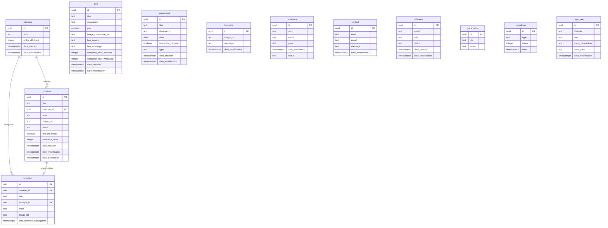

# Schéma de base de données

## Vue d'ensemble

| Table | Rôle |
|---|---|
| rubrique | Catégories de contenu éditorial (pensées, enseignements, encouragements) |
| contenu | Articles éditoriaux publiés sur le site public |
| livre | Ouvrages du pasteur avec liens de redirection Amazon et WhatsApp |
| evenement | Rencontres et événements du ministère (récurrents et spéciaux) |
| banniere | Image et message de la section hero de la page d'accueil |
| partenaire | Soumissions du formulaire de partenariat financier |
| contact | Soumissions du formulaire de contact général |
| utilisateur | Profils des administrateurs back-office liés à Supabase Auth |
| parametre | Configuration clé-valeur (numéro WhatsApp, etc.) |
| statistique | Événements de tracking (vues, clics, formulaires) |
| brouillon | Sauvegardes automatiques des contenus en cours de rédaction |
| page_seo | Métadonnées SEO par page publique |

## Diagramme ER

## Détail des tables

### rubrique
- id : UUID, PRIMARY KEY, DEFAULT gen_random_uuid()
- nom : TEXT, NOT NULL, UNIQUE
- ordre_affichage : INT, NOT NULL, DEFAULT 0
- date_creation : TIMESTAMPTZ, DEFAULT NOW()
- date_modification : TIMESTAMPTZ, DEFAULT NOW()

### contenu
- id : UUID, PRIMARY KEY, DEFAULT gen_random_uuid()
- titre : TEXT, NOT NULL
- rubrique_id : UUID, NOT NULL, FOREIGN KEY → rubrique(id) ON DELETE RESTRICT
- texte : TEXT, DEFAULT ''
- image_url : TEXT
- statut : TEXT, NOT NULL, DEFAULT 'non_publie', CHECK IN ('publie', 'non_publie')
- mis_en_avant : BOOLEAN, DEFAULT FALSE
- compteur_vues : INT, DEFAULT 0
- date_creation : TIMESTAMPTZ, DEFAULT NOW()
- date_modification : TIMESTAMPTZ, DEFAULT NOW()
- date_publication : TIMESTAMPTZ

### livre
- id : UUID, PRIMARY KEY, DEFAULT gen_random_uuid()
- titre : TEXT, NOT NULL
- description : TEXT, DEFAULT ''
- prix : DECIMAL(10,2), DEFAULT 0
- image_couverture_url : TEXT
- lien_amazon : TEXT
- lien_whatsapp : TEXT
- compteur_clics_amazon : INT, DEFAULT 0
- compteur_clics_whatsapp : INT, DEFAULT 0
- date_creation : TIMESTAMPTZ, DEFAULT NOW()
- date_modification : TIMESTAMPTZ, DEFAULT NOW()

### evenement
- id : UUID, PRIMARY KEY, DEFAULT gen_random_uuid()
- titre : TEXT, NOT NULL
- description : TEXT, DEFAULT ''
- date : DATE, NOT NULL
- inscription_requise : BOOLEAN, DEFAULT FALSE
- type : TEXT, NOT NULL, DEFAULT 'special', CHECK IN ('recurrent', 'special')
- date_creation : TIMESTAMPTZ, DEFAULT NOW()
- date_modification : TIMESTAMPTZ, DEFAULT NOW()

### banniere
- id : UUID, PRIMARY KEY, DEFAULT gen_random_uuid()
- image_url : TEXT
- message : TEXT, DEFAULT ''
- date_modification : TIMESTAMPTZ, DEFAULT NOW()

### partenaire
- id : UUID, PRIMARY KEY, DEFAULT gen_random_uuid()
- nom : TEXT, NOT NULL
- email : TEXT, NOT NULL
- pays : TEXT, NOT NULL
- date_soumission : TIMESTAMPTZ, DEFAULT NOW()
- statut : TEXT, DEFAULT 'soumis'

### contact
- id : UUID, PRIMARY KEY, DEFAULT gen_random_uuid()
- nom : TEXT, NOT NULL
- email : TEXT, NOT NULL
- message : TEXT, NOT NULL
- date_soumission : TIMESTAMPTZ, DEFAULT NOW()

### utilisateur
- id : UUID, PRIMARY KEY, FOREIGN KEY → auth.users(id) ON DELETE CASCADE
- email : TEXT, NOT NULL, UNIQUE
- role : TEXT, NOT NULL, DEFAULT 'lecture_seule', CHECK IN ('total', 'lecture_seule')
- statut : TEXT, NOT NULL, DEFAULT 'actif', CHECK IN ('actif', 'desactive')
- date_creation : TIMESTAMPTZ, DEFAULT NOW()
- date_modification : TIMESTAMPTZ, DEFAULT NOW()

### parametre
- id : UUID, PRIMARY KEY, DEFAULT gen_random_uuid()
- cle : TEXT, NOT NULL, UNIQUE
- valeur : TEXT, DEFAULT ''

### statistique
- id : UUID, PRIMARY KEY, DEFAULT gen_random_uuid()
- type : TEXT, NOT NULL, CHECK IN ('visite', 'vue_contenu', 'clic_whatsapp', 'clic_amazon', 'formulaire_partenariat', 'formulaire_contact')
- valeur : INT, DEFAULT 1
- date : TIMESTAMPTZ, DEFAULT NOW()

### brouillon
- id : UUID, PRIMARY KEY, DEFAULT gen_random_uuid()
- contenu_id : UUID, FOREIGN KEY → contenu(id) ON DELETE SET NULL
- titre : TEXT, DEFAULT ''
- rubrique_id : UUID, FOREIGN KEY → rubrique(id) ON DELETE SET NULL
- texte : TEXT, DEFAULT ''
- image_url : TEXT
- date_derniere_sauvegarde : TIMESTAMPTZ, DEFAULT NOW()

### page_seo
- id : UUID, PRIMARY KEY, DEFAULT gen_random_uuid()
- chemin : TEXT, NOT NULL, UNIQUE
- titre : TEXT, DEFAULT ''
- meta_description : TEXT, DEFAULT ''
- mots_cles : TEXT, DEFAULT ''
- date_modification : TIMESTAMPTZ, DEFAULT NOW()

## Foreign Keys

| Source | Colonne | Cible | Règle de suppression |
|---|---|---|---|
| contenu | rubrique_id | rubrique(id) | RESTRICT |
| brouillon | contenu_id | contenu(id) | SET NULL |
| brouillon | rubrique_id | rubrique(id) | SET NULL |
| utilisateur | id | auth.users(id) | CASCADE |

## Notes

- La table `utilisateur` est un profil lié à `auth.users` (géré par Supabase Auth). Aucun mot de passe n'est stocké dans cette table.
- Les colonnes `partenaire.email` et `contact.email` n'ont pas de contrainte UNIQUE. Les doublons sont acceptés.
- Les colonnes `brouillon.contenu_id` et `brouillon.rubrique_id` sont nullable (SET NULL en cas de suppression de la référence).
- La table `statistique` n'a pas de policy RLS publique. Seul le rôle `service_role` y accède (bypass RLS).
